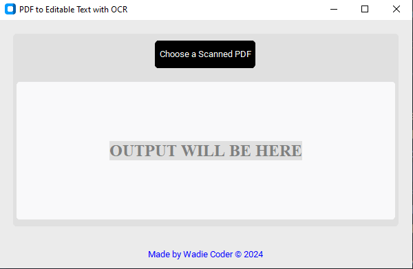

# WD PDF Extractor

**WD PDF Extractor** is a simple and efficient tool for extracting text from scanned PDF files using OCR (Optical Character Recognition). With this application, you can avoid paying for OCR services like "iLovePDF" and instead leverage open-source tools to process PDF files on your local machine. The application is built using `pdf2image` and `pytesseract` for OCR functionality and `ReportLab` for saving the extracted text into a new PDF file.

<p align="center">
  
</p>

## Why Use WD PDF Extractor?
WD PDF Extractor allows you to convert scanned PDF files into editable text without the need for expensive online OCR services. By running the tool locally, you can save money while gaining full control over your files. Whether you're a student, professional, or just someone who needs to process PDFs, WD PDF Extractor makes it easy to extract and save the text in a PDF format for future use.

The application is designed to be user-friendly, with a simple and modern GUI built with `customtkinter`, making the extraction process quick and hassle-free.

## Features
- **No Cost OCR**: Avoid subscription-based OCR services by processing PDFs locally with open-source tools.
- **Customizable**: Easily modify the extracted text and save it as a new PDF file.
- **Simple Setup**: No need for complex configurations or paid services—just install the necessary packages and you're ready to go.
- **Clean and Modern Interface**: Built with `customtkinter`, the app provides a polished UI for an easy user experience.
- **Text Extraction with OCR**: Uses `pdf2image` to convert PDF pages into images, then applies `pytesseract` to extract text with high accuracy.

## Installation

### Prerequisites
To run the WD PDF Extractor, you need to install some necessary dependencies:

1. **Install Poppler**: Poppler is required for converting PDF files to images. You can install it using the following instructions:
   - For **Windows**, download Poppler from [here](http://blog.alivate.com.au/poppler-windows/).
   - For **macOS**, use Homebrew:
     ```bash
     brew install poppler
     ```
   - For **Linux** (Debian/Ubuntu-based systems), use:
     ```bash
     sudo apt-get install poppler-utils
     ```

2. **Install Tesseract OCR**: Tesseract is the OCR engine used to extract text from images.
   - For **Windows**, download the installer from [here](https://github.com/tesseract-ocr/tesseract).
   - For **macOS**, use Homebrew:
     ```bash
     brew install tesseract
     ```
   - For **Linux**, use:
     ```bash
     sudo apt-get install tesseract-ocr
     ```

3. **Install Python Packages**: Install the required Python packages by running:
   ```bash
   pip install customtkinter
   pip install pillow
   pip install pdf2image
   pip install pytesseract
   pip install reportlab
   ```

### Running the Script
Once you have installed the dependencies, you can run the script locally:

1. **Clone or Download the Repository**: Download or clone the WD PDF Extractor repository.
2. **Run the Script**: Navigate to the directory containing the script and execute:
   ```bash
   python pdf-ocr-to-editable-text.py
   ```

## How to Use WD PDF Extractor
1. **Select a Scanned PDF**: Click the "Choose a Scanned PDF" button in the GUI to select the PDF file from which you want to extract text.
2. **Extract Text**: The OCR process will begin, and the extracted text will be displayed in the text box within the app.
3. **Save as PDF**: You can save the extracted text into a new PDF file by clicking the "Save" button. Choose the location and filename for the new PDF.

## Future Improvements
WD PDF Extractor is still evolving! Future updates will include:
- Improved OCR accuracy with advanced configurations.
- Enhanced UI features for better user experience.
- Ability to extract text from multiple pages simultaneously.

## Made with Love by Wadie Coder
This application was created with passion and care by **[wadiecoder.com](https://www.wadiecoder.com)**.

## Contact Me
If you have any questions or suggestions, feel free to reach out to me via email:

**Email**: [wadie@wadiecoder.com](mailto:wadie@wadiecoder.com)

**Instagram**: [@wadie.coder](https://www.instagram.com/wadie.coder/)
